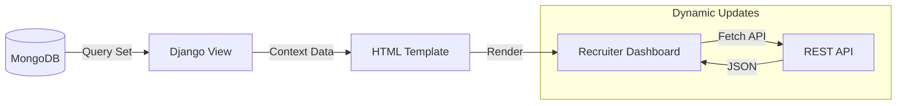

# AI-Powered Resume Screening System - Dashboard & Analytics

## 1. HR Recruiter Workflow (End-to-End)

The dashboard is designed to streamline the recruitment process. The typical workflow is as follows:

1.  **Job Creation**: The recruiter logs in and posts a new job (e.g., "Data Scientist") with specific skills (Python, Pandas).
2.  **Sourcing**: The system accepts resume uploads (bulk or single) against the job.
3.  **Screening Trigger**: The recruiter clicks "Run AI Screening".
4.  **Review**: The system ranks candidates. The recruiter reviews the top matches.
5.  **Action**: The recruiter can download the CV or contact the candidate (future scope).

## 2. Dashboard Analytics Views

### 2.1 Job-Wise Candidate Analytics
A high-level view for every posted job:
-   **Total Candidates**: Number of applicants.
-   **Top Match**: The candidate with the highest similarity score.
-   **Average Quality**: Mean score of all applicants (helps gauge if sourcing channels are effective).

### 2.2 Candidate Ranking Logic
Candidates are displayed in a sorted table based on **Reverse Similarity Score**.
-   **Green (Score > 0.7)**: Highly Recommended. Strong overlap in skills and experience.
-   **Yellow (0.4 - 0.7)**: Potential match. Some skills missing.
-   **Red (< 0.4)**: Not relevant.

### 2.3 Skill Match Percentage
The system provides a granular breakdown (handled by `ScreeningResult.skill_match_details`):
-   **Matched Skills**: Skills present in both Job Description and Resume.
-   **Missing Skills**: Critical skills required but not found.
-   **Visualization**: A progress bar represents the overall match % (e.g., 85%).

## 3. Data Flow: Backend to Dashboard

1.  **Initial Load**: Django templates render the static structure and user info.
2.  **Data Fetching**: JavaScript (Fetch API) calls `/api/jobs/` and `/api/screening/results/`.
3.  **Rendering**: The browser dynamically creates table rows and progress bars based on the JSON response.

## 4. Visualization & UI Components

### 4.1 Score Visualization
We use color-coded progress bars to allow quick scanning:
-   `bg-success` (Green) for scores > 70%
-   `bg-warning` (Yellow) for scores > 40%
-   `bg-danger` (Red) for scores < 40%

### 4.2 Candidate Card
Each row in the results table acts as a summary card:
-   **Name**: Candidate Name
-   **Score**: Numeric value (e.g., 0.85)
-   **Status**: "Recommended", "Review", or "Reject"
