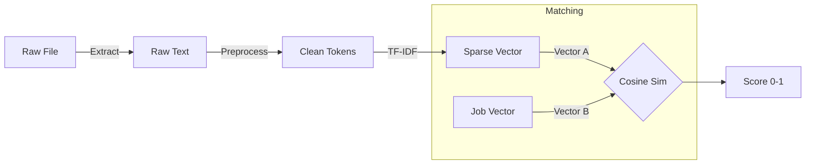

# AI-Powered Resume Screening System - NLP & ML Pipeline

## 1. Overview
The Machine Learning pipeline is responsible for matching candidates to job descriptions based on semantic similarity and keyword overlap. It uses a hybrid approach of **TF-IDF Vectorization** for feature extraction and **Cosine Similarity** for ranking. A **Logistic Regression** model can be layered on top for supervised classification (Relevant/Not Relevant).

## 2. Text Extraction Layer
Before any processing, text must be extracted from binary file formats.
*   **PDF**: Uses `pdfminer.six` to extracting text from text-based PDFs. OCR (Tesseract) would be needed for scanned PDFs (not currently implemented).
*   **DOCX**: Uses `python-docx` to read paragraphs from Word documents.
*   **TXT**: Reads standard UTF-8 text files.

## 3. Preprocessing Pipeline
Raw text is noisy. The `clean_text` function performs the following steps:
1.  **Lowercasing**: Uniforms the text (e.g., "Python" -> "python").
2.  **URL Removal**: Strips hyperlinks using Regex.
3.  **Special Character Removal**: Removes non-alphanumeric characters (keeps spaces).
4.  **Tokenization**: Splits text into individual words.
5.  **Stopword Removal**: Removes common English words (and, the, is) using NLTK.
6.  **Lemmatization**: Reduces words to base form (e.g., "coding" -> "code") using `WordNetLemmatizer`.

## 4. Feature Engineering: TF-IDF
Term Frequency-Inverse Document Frequency (TF-IDF) converts text into numerical vectors.
*   **TF**: How often a word appears in a resume.
*   **IDF**: Down-weights words that appear in *all* documents (e.g., "experience", "resume").
*   **Vocabulary**: Built dynamically from the corpus of (Job Description + All Resumes).

## 5. Similarity & Ranking Logic (Unsupervised)
This is the core "Screening" logic currently active in the system.
1.  **Corpus Creation**: `[Job Description] + [List of Resumes]`
2.  **Vectorization**: `fit_transform` the entire corpus.
3.  **Cosine Similarity**: Measures the cosine of the angle between vectors.
    *   Formula: $Similarity = \cos(\theta) = \frac{A \cdot B}{||A|| ||B||}$
    *   Range: 0 (No match) to 1 (Perfect match).
4.  **Ranking**: Resumes are sorted by descending similarity score.

## 6. Supervised Classification (Logistic Regression)
*Proposed extension for binary classification.*

### 6.1 Dataset Structure
For training, we require a labeled dataset:
| Resume_Text | Job_Description | Label (0/1) |
| :--- | :--- | :--- |
| "Exp: Python..." | "Need Python Dev..." | 1 |
| "Exp: Chef..." | "Need Python Dev..." | 0 |

### 6.2 Training Workflow
1.  **Split Data**: Train/Test split (e.g., 80/20).
2.  **Pipeline Construction**:
    ```python
    pipeline = Pipeline([
        ('tfidf', TfidfVectorizer()),
        ('clf', LogisticRegression())
    ])
    ```
3.  **Training**: `pipeline.fit(X_train, y_train)`
4.  **Evaluation**:
    *   **Accuracy**: Overall correctness.
    *   **Precision**: Exactness (low false positives).
    *   **Recall**: Completeness (low false negatives).
    *   **F1-Score**: Harmonic mean of Precision and Recall.

## 7. Model Evaluation Metrics
For the Resume Screening context:
*   **High Recall** is preferred: We don't want to miss a good candidate.
*   **Ranking Metrics**:
    *   **NDCG (Normalized Discounted Cumulative Gain)**: Measures if relevant items are ranked at the top.
    *   **Precision@K**: How many of the top K candidates are actually relevant?

## 8. Diagram: The Pipeline

